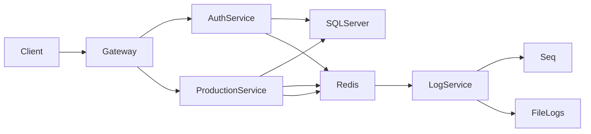
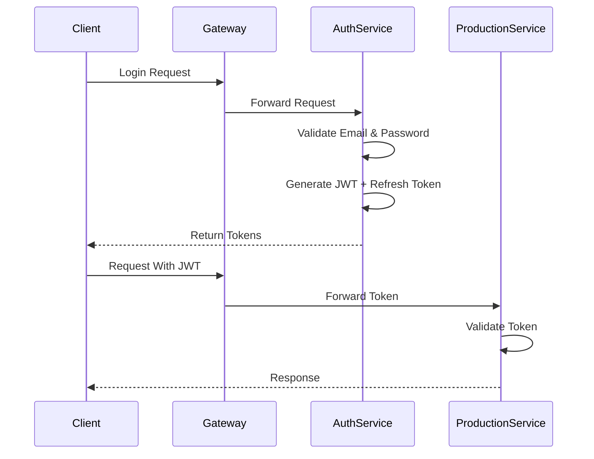
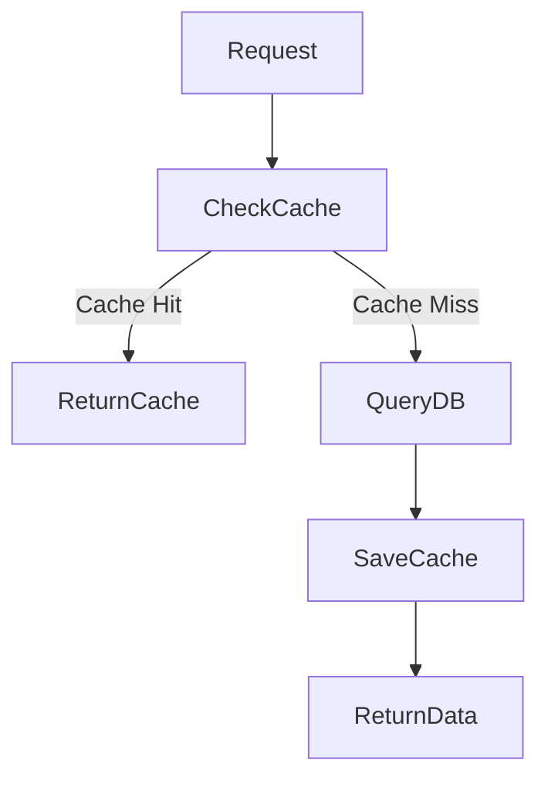
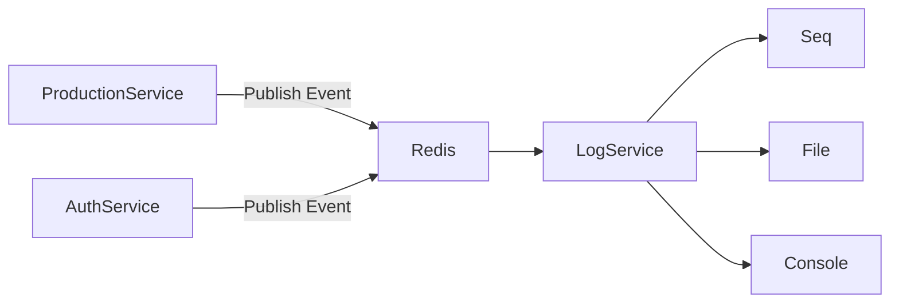

# Kayra Export Commerce – Microservices Architecture

Modern yazılım mimarileri kullanılarak geliştirilmiş bir **.NET Microservices e‑ticaret altyapı simülasyonu**. Proje; kimlik doğrulama, ürün yönetimi, merkezi loglama ve API Gateway katmanlarından oluşan dağıtık bir sistem mimarisini göstermeyi amaçlar.

---

# 🚀 Projenin Amacı

Bu proje aşağıdaki modern backend konseptlerini göstermek için geliştirilmiştir:

* Microservices Architecture
* API Gateway Pattern
* JWT Authentication & Refresh Token
* Redis Cache
* Event Driven Communication
* CQRS Pattern
* Onion Architecture
* Centralized Logging
* Docker Containerization
* CI/CD (GitHub Actions)

Bu proje bir **production simülasyonu** olup gerçek dünyadaki dağıtık sistem mimarilerinin küçük ölçekli bir temsilidir.

---

# 🧱 Sistem Mimarisi



---

# 🧩 Microservice Yapısı

| Service            | Açıklama                                       |
| ------------------ | ---------------------------------------------- |
| Auth Service       | Kullanıcı doğrulama, JWT üretimi, rol yönetimi |
| Production Service | Ürün CRUD işlemleri ve caching                 |
| Log Service        | Event ve log mesajlarını merkezi toplama       |
| API Gateway        | Servisleri tek giriş noktasında toplama        |

---

# 🔐 Authentication Flow



---

# 📦 Product Service Flow (Cache Pattern)



Cache invalidation işlemleri:

* Product Create
* Product Update
* Product Delete

Bu işlemler sonrası ilgili cache kayıtları temizlenir.

---

# 📡 Event Driven Logging

Microservisler önemli işlemler sonrasında Redis üzerinden event yayınlar.



---

# 🛠 Kullanılan Teknolojiler

| Teknoloji             | Amaç                          |
| --------------------- | ----------------------------- |
| .NET Core             | Microservice geliştirme       |
| ASP.NET Identity      | Kullanıcı doğrulama           |
| JWT                   | Token tabanlı authentication  |
| Entity Framework Core | ORM                           |
| SQL Server            | Veritabanı                    |
| Redis                 | Cache & Event Communication   |
| MediatR               | CQRS implementasyonu          |
| Serilog               | Loglama                       |
| Docker                | Containerization              |
| Docker Compose        | Multi-container orchestration |
| GitHub Actions        | CI Pipeline                   |

---

# 🧠 Kullanılan Tasarım Desenleri

### Onion Architecture

Business logic katmanlarının bağımlılıklarını tersine çevirerek daha test edilebilir ve sürdürülebilir bir yapı sağlar.

### CQRS (Command Query Responsibility Segregation)

Veri okuma ve yazma operasyonları ayrılmıştır.

Örnek:

**Commands**

* CreateProduct
* UpdateProduct
* DeleteProduct

**Queries**

* GetProducts
* GetProductById

### Mediator Pattern

Servis içi iletişimi merkezi bir mediator üzerinden yönetmek için **MediatR** kullanılmıştır.

---

# 🐳 Docker ile Kurulum

Projeyi herhangi bir manuel servis kurmadan çalıştırabilirsiniz.

### 1️⃣ Repo klonlayın

```
git clone https://github.com/capanoglu-hus/KayraExportCommerce.git

cd KayraExportCommerce
```

### 2️⃣ Sistemi başlatın

```
docker-compose up -d --build
```

### 3️⃣ API erişimi

Docker ortamı:

```
http://localhost:5000
```

Local geliştirme ortamı:

```
http://localhost:5125
```

---

# 📚 API Endpointleri

## Auth Service

### Register

```
POST /auth-service/auth/register
```

Body:

```
{
  "username": "user",
  "email": "user@mail.com",
  "password": "Password123!"
}
```

---

### Login

```
POST /auth-service/auth/login
```

Response:

```
{
  "accessToken": "...",
  "refreshToken": "..."
}
```

---

### Revoke Token

```
POST /auth-service/auth/revoke
```

---

## Production Service

### Get All Products

```
GET /production-service/product
```

---

### Get Product By Id

```
GET /production-service/product/GetProduct?id={id}
```

---

### Create Product

```
POST /production-service/product
```

JWT gereklidir.

---

### Update Product

```
PUT /production-service/product
```

---

### Delete Product

```
DELETE /production-service/product?id={id}
```

---

# 📊 CI Pipeline

Proje GitHub Actions ile otomatik build kontrolüne sahiptir.

Pipeline aşamaları:

1. Restore
2. Build
3. Test

---


[https://github.com/capanoglu-hus](https://github.com/capanoglu-hus)
